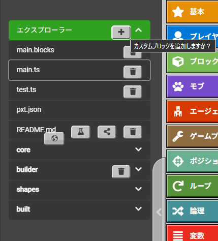

> このページを開く [https://v-code-japan.github.io/lesson-template/](https://v-code-japan.github.io/lesson-template/)

# V-code レッスンテンプレート

V-codeのレッスンを作成するためのテンプレートです。

## チュートリアル編集方法

[mission1.md](mission1.md), [mission2.md](mission2.md), [mission3.md](mission3.md), [mission4.md(missionクリア後)](mission4.md)

を各レッスンに合わせて編集してください。

作成したチュートリアルのURLは以下のようになります。
https://minecraft.makecode.com/#tutorial:github:v-code-japan/リポジトリ名/mission1-4

## オリジナルブロックの追加方法

[custom.ts](custom.ts)のコメントアウト部分をもとに戻して編集

新たなファイルに作成した場合は以下の通り

エクスプローラーの＋を押して作成されたファイル内にコードを追加

## 作成したチュートリアルを確認するときの注意

作成したチュートリアルのURLは**シークレットモード**で開いてください。

（同じ名前のチュートリアルを何度も開こうとするとエラーが出て開けない様子）